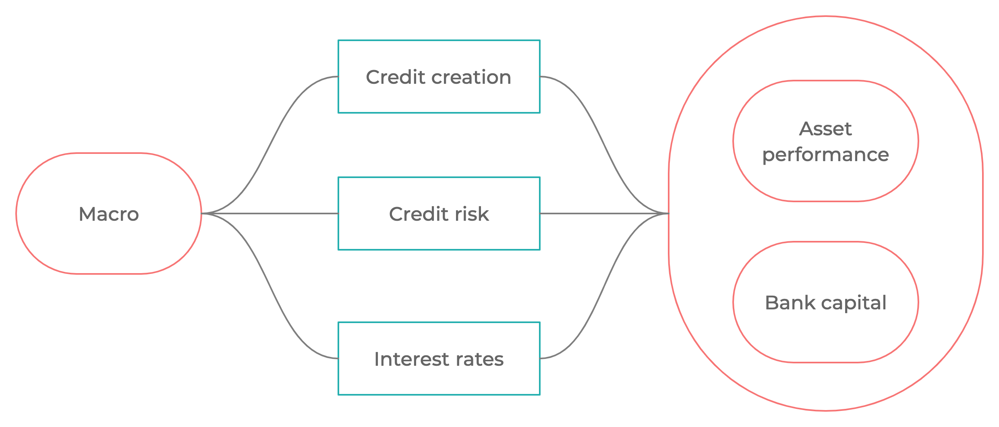
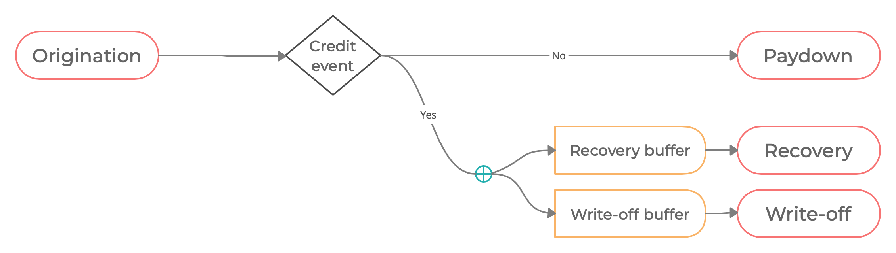
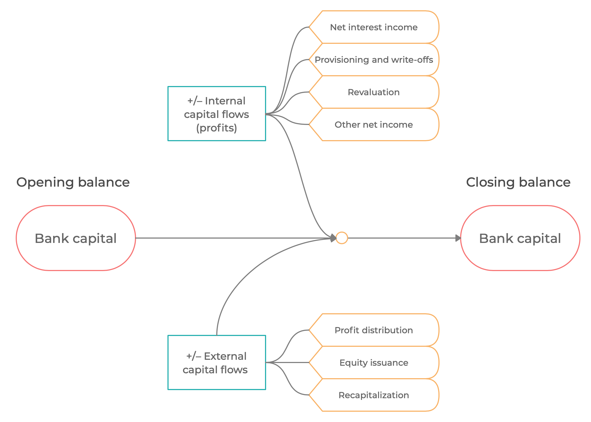
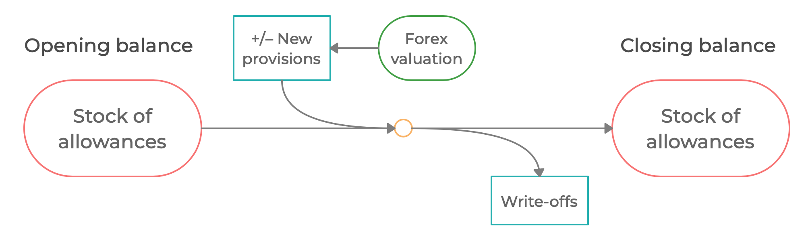
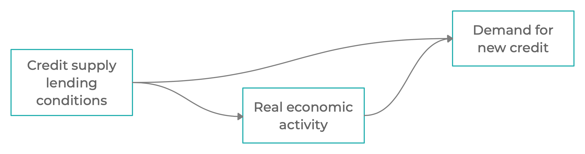
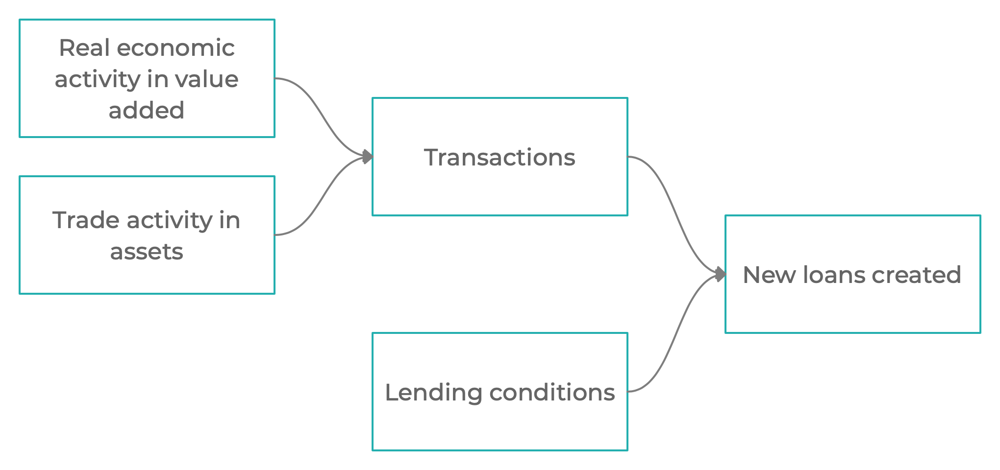
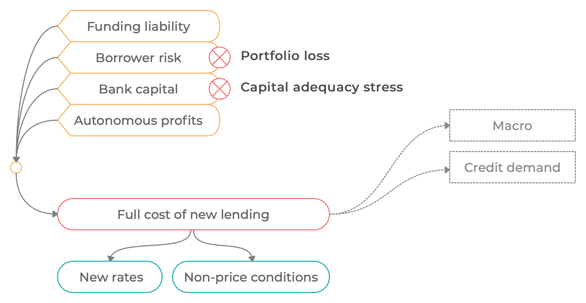
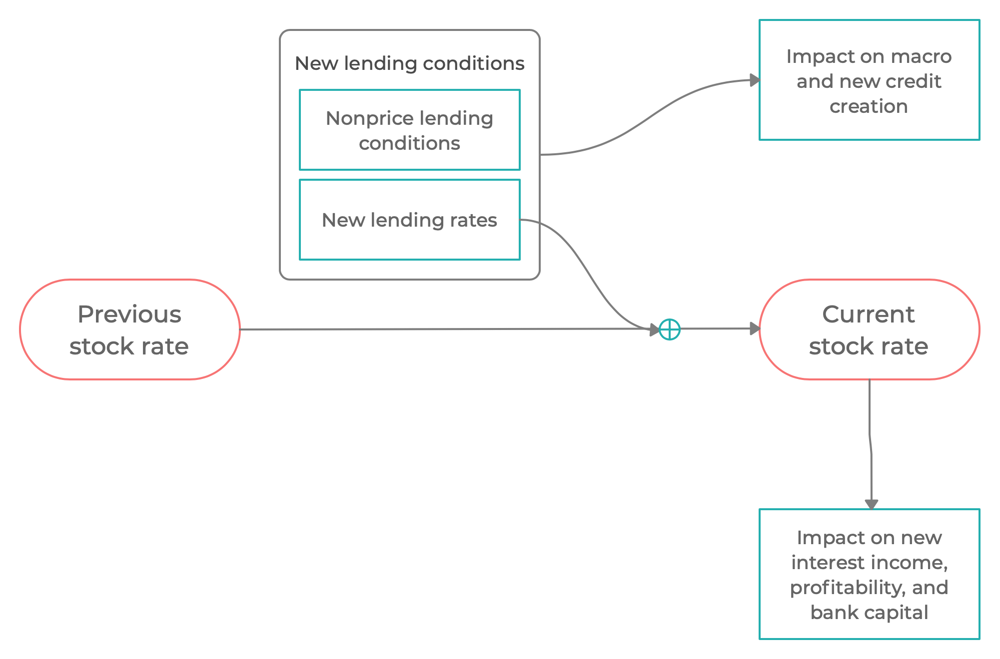
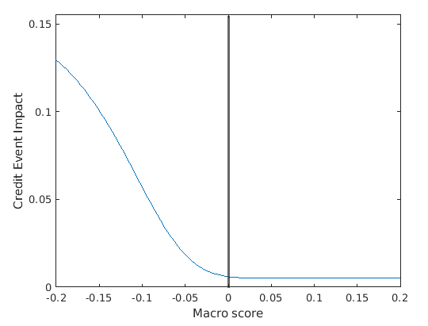
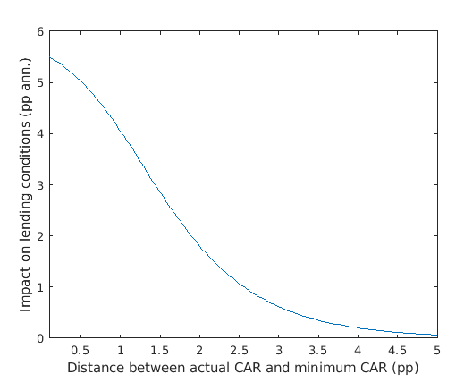

# Introduction to GIMM Macroprudential Modeling Framework

$$
\newcommand{\xona}[1][t]{{ona}_{#1}}
\newcommand{\xrona}[1][t]{rona_{#1}}
\newcommand{\xy}{\mathit{y}}
\newcommand{\xyfwl}{\mathit{y}^\mathrm{fws}}
\newcommand{\xpy}{\mathit{py}}
\newcommand{\xny}{\mathit{ny}}
\newcommand{\xlcy}{\mathrm{lcy}}
\newcommand{\xhcy}{\mathrm{hcy}}
\newcommand{\xfcy}{\mathrm{fcy}}
\newcommand{\xxpvc}[1]{{\mathit{pvc}^0_{#1}}}
\newcommand{\xrepay}[1][t]{\theta_{lp}}
\newcommand{\xrepayk}[1]{\theta_{lp}^{#1}}
\newcommand{\xrecover}[1][t]{\theta_{lnc}}
\newcommand{\xrecover}[1][t]{\theta_{lnc}}
\newcommand{\xwoffdown}[1][t]{\theta_{lnw}}
\newcommand{\xrd}[1][t]{\mathit{rd}_{#1}}
\newcommand{\xrl}[1][t]{\mathit{rl}_{#1}}
\newcommand{\xrnewl}[1]{\mathit{rl}^{\Delta}_{#1}}
\newcommand{\xrlss}{\mathit{rl}}
\newcommand{\xl}[1][t]{\mathit{l}_{#1}}
\newcommand{\xlk}[2]{\mathit{l}_{#1}^{#2}}
\newcommand{\xd}[1][t]{\mathit{d}_{#1}}
\newcommand{\xdo}[2]{\mathit{d}^{0 #2}_{#1}}
\newcommand{\xnewl}[2]{\mathit{l}^{\Delta #2}_{#1}}
\newcommand{\xlp}[1][t]{\mathit{lp}_{#1}}
\newcommand{\xlpk}[2]{\mathit{lp}^{#2}_{#1}}
\newcommand{\xlpo}[2]{\mathit{lp}^{0 #2}_{#1}}
\newcommand{\xlc}[1][t]{\mathit{lc}_{#1}}
\newcommand{\xlco}[2]{\mathit{lc}^{0 #2}_{#1}}
\newcommand{\xle}[1][t]{\mathit{le}_{#1}}
\newcommand{\xln}[1][t]{\mathit{ln}_{#1}}
\newcommand{\xlno}[1][t]{\mathit{ln}^0_{#1}}
\newcommand{\xlo}[1][t]{\mathit{l}^{\,0}_{#1}}
\newcommand{\xlnc}[1][t]{\mathit{lnc}_{#1}}
\newcommand{\xlnco}[1][t]{\mathit{lnc}^0_{#1}}
\newcommand{\xlnw}[1][t]{\mathit{lnw}_{#1}}
\newcommand{\xlnwo}[1][t]{\mathit{lnw}^0_{#1}}
\newcommand{\xlgd}{\lambda}
\newcommand{\xclr}[1][t]{q_{#1}}
\newcommand{\xall}[1][t]{\mathit{a}_{#1}}
\newcommand{\xaf}[1][t]{\mathit{af}_{#1}}
\newcommand{\xab}[1][t]{\mathit{ab}_{#1}}
\newcommand{\xpvc}[1][t]{\mathit{pvc}_{#1}}
\newcommand{\xpvx}[1][t]{\mathit{pvx}_{#1}}
\newcommand{\xwoff}[1][t]{\mathit{w}_{#1}}
\newcommand{\xnewall}[2]{\mathit{a}_{#1}^{\Delta #2}}
\newcommand{\xdisc}[2]{\mathit{\delta}_{#1,#2}}
\newcommand{\xdiscxx}[2]{\mathit{\delta}_{#1,#2}^{**}}
\newcommand{\xbk}[1][t]{\mathit{bk}_{#1}}
\newcommand{\xnewbk}[1][t]{\mathit{bk}_{#1}^\Delta}
\newcommand{\xpie}[1][t]{\Pi_{#1}}
\newcommand{\xj}[1][t]{j_{#1}}
\newcommand{\xjl}[1][t]{jl_{#1}}
\newcommand{\xjd}[1][t]{jd_{#1}}
\newcommand{\xsigma}[1]{\sigma_{#1}}
\newcommand{\xe}[1][t]{e_{#1}}
\newcommand{\xemphk}{\color{red}{k}}
\newcommand{\xrbk}[1][t]{\mathit{rbk_{#1}}}
\newcommand{\xss}{\mathit{ss}}
\newcommand{\xrec}[1][t]{\mathit{rec}_{#1}}
\newcommand{\xcar}[1][t]{{car}_{#1}}
\newcommand{\xcartar}[1][t]{{car}_{#1}^{\mathrm{tar}}}
\newcommand{\xcarmin}[1][t]{{car}_{#1}^{\mathrm{min}}}
\newcommand{\xcarbfr}[1][t]{{car}_{#1}^{\mathrm{bfr}}}
\newcommand{\xrw}[1][t]{\mathit{rw}_{#1}}
\newcommand{\xtrn}[2]{\mathit{trn}^{\,#2}_{\,#1}}
\newcommand{\xvel}[2]{\mathit{vel}^{\,#2}_{\,#1}}
\newcommand{\xshock}[2]{\varepsilon_{#2,\, #1}}
\newcommand{\xk}{{\color{Apricot}{k}}}
\newcommand{\xrx}[1][t]{{rx}_{#1}}
\newcommand{\xnewln}[1][t]{ln^\Delta_{#1}}
\newcommand{\xnewlnk}[2]{ln^{\Delta #2}_{#1}}
\newcommand{\xlprec}[1][t]{lp^\mathrm{rec}_{#1}}
\newcommand{\xlpreco}[1][t]{lp^{0\, \mathrm{rec}}_{#1}}
\newcommand{\xlnrec}[1][t]{ln^\mathrm{rec}_{#1}}
\newcommand{\xlnreco}[1][t]{ln^{0\, \mathrm{rec}}_{#1}}
\newcommand{\xonfx}[1][t]{\mathit{onfx}_{#1}}
\newcommand{\rec}{\mathrm{rec}}
\notag
$$

*Jaromir Benes*
*Tomas Motl*

GIMM Inaugural Workshop
April 2022

---

### Introduction

* We will accompany contributions by speakers by macroprudential model simulations 
* This presentation introduces the modeling framework (MESSr)
* Non-technical exposition, focusing on guiding principles

### About the framework

* Outcome of several applied macroprudential modeling projects
* Focused on production, not theoretical insights
  * Motivated by insights from DSGE models such as MAPMOD
  * But flexible semi-structural approach for practical reasons
* Ongoing development based on real-world needs

### Key modeling principles

* Top-down view of the economy
  * Complements the usual FinStab bottom-up approach
  * Works with aggregate concepts, not individual financial institutions
* Endogenous feedback loops: (macroeconomy <--> financial sector)
  * Complements the traditional FinStab approach (macro --> financial sector)
* Medium-term view
  * Complements FinStab approach which is usually short-term
  * Important to analyze macroprudential policy:
    * Time for endogenous feedbacks to kick in
    * Trade-offs of small and obvious costs now vs large potential gains in future

### Key modeling principles, cont.

* Explicit description of balance sheets
  * Need good description how balance sheets increase / shrink and implications of that for macroeconomy
  * Non-trivial, money and deposit creation are often understudied
  * Gross positions matter, not just net positions
* Stock-flow consistency:
  * Proper link between stocks (wealth, credit stock, assets / liabilities) and flows (GDP, credit creation, defaults / repayments)
* Important role of non-linearities
  * Necessary to render macroprudential policy relevant and useful
  * Important to describe real-world events

### Focus on application

* MESSr is a semi-structural framework
  * Explicit concepts of demand and supply (e.g. for credit)
  * Endogenous expectations (can drive financial cycles)
  * Model brought to data, provide data-consistent simulations (as opposed to purely theoretical simulations)
* Integration and aggregation of several types of risk
* Flexibility to describe various structures of financial system
  * Primary focus on banks, but also other intermediaries too

### Not just a model

* Model itself is not enough
* Need infrastructure for regular, streamlined production of outputs
  * Feeding data to the model
  * Streamlined processing of macro inputs
  * Reporting, communication of results
* Ability to build scenarios on top of (externally provided) baseline
* Motivated by experience from and focus on practical applications

### Differences from other macropru frameworks

* No endogenous macroprudential policy reaction function
* No detailed description of individual banks
* Focus on scenario analysis, not forecasting
* Focus on robust policy vs optimal policy

### Main model blocks

### Banking sector balance sheet

|                   | Assets                         |            Liabilities |                   |
| :---------------- | :----------------------------- | ---------------------: | ----------------: |
| \xle              | Net loans                      | Non-equity liabilities |               \xd |
| +\ \sum \xl^{\,k} | *Gross loans*                  |       *Local currency* |  d_t^{\,\xlcy}\ + |
| -\ \sum \xall^k   | *Allowances for credit losses* |     *Foreign currency* | d_t^{\,\xfcy} \ + |
| \xona             | Other net assets               |           Bank capital |                bk |

* We allow for:
  * Loan portfolio segmentation (mortgages, consumer credit, ...)
  * Currency segmentation (local vs foreign currency denominated loans)

### Proper balance sheet accounting

* For each loan segment, the model keeps track of performing loans, non-performing loans, allowances...

*Simplified life cycle of a representative loan*

### Explicit modeling of bank capital, P&L

### Forward-looking creation of allowances

* New allowances (provisions) are created based on expected (forward-looking) loss
* We can also model provisions based on incurred (backward-looking) loss

*Dynamics of allowances*

### Credit creation

__Reduced-form approach__

Provides little insight into demand and supply forces in the credit market

__Semistructural approach__

Motivated by insights from DSGE models, provides more insight. Our approach

### Credit supply and demand

### Credit supply - lending conditions

* Key component of the model

### Stock lending rate vs new lending rate

### Key nonlinearity 1: Credit risk function

* Link of credit risk to macro conditions (??????) is non-linear

### Key nonlinearity 2: Capital risk surcharge

