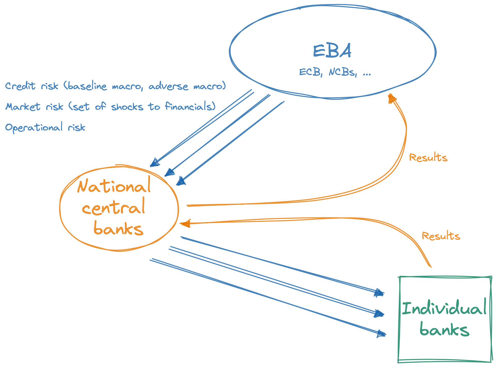
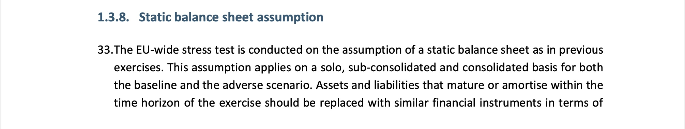
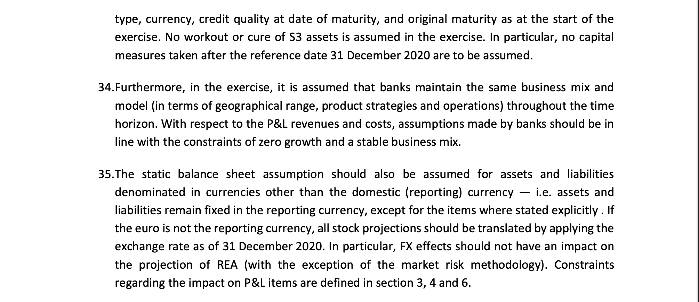
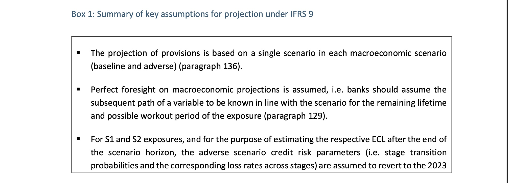
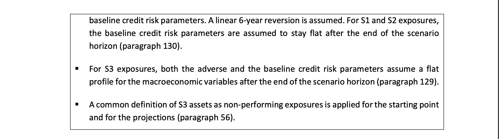

# Delta Method

*Jaromir Benes* jaromir.benes@gimm.institute
*Tomas Motl* tomas.motl@gimm.institute

GIMM Inaugural Workshop
April 2022

---

### Introduction

* Simple method to create model-based scenarios on top of (derive from) a baseline input scenario

* The input scenario may be (and usually is) "incomplete": describing only a subset of variables (e.g. macro)

* The model-based scenario is derived from the input scenario but does not keep the input variables fixed: all respond endogenously to extra assumptions

---

### Use cases

* Conceptually and technically simple, but with wide applications:

	* Building scenarios on top of external macro forecast 
	* Analysis of policy interventions - past and future
	* Top-down stress tests 
	* Complement to existing stress-testing frameworks, e.g. EU-wide stress tests
	
* We can impose all kinds of additional assumptions on top of external baseline scenario:

	* Credit risk: varying assumptions about asset performance
	* Market risk
	* Other kinds of risk: operational risk, ...

---

### Inputs

* Baseline scenario from external source
	* Can be macro only, or macro+financial sector
	* Does not need to cover all variables in the model
	* Typical example: baseline macroeconomic forecast
* Data on current position of the economy and financial sector
* The model

---

### Conceptual explanation
* Adopt the baseline scenario from an external source as a starting point
* Reproduce the baseline scenario by a so-called model inversion
	* Replicate paths of variables from the baseline scenario by our model
	* As a by-product, we obtain projection for all variables in our model, incl. those variables which are not in the baseline scenario itself
* Add your own additional assumptions (shocks)
* Obtain new scenario which is based on the baseline scenario + the impact of the additional assumption

---

### Technical explanation 
* Assume you want to build a macrofinancial scenario consistent with externally provided macro forecast

$$
\left( \begin{matrix} m_t \\ 
					  f_t 
	   \end{matrix} 
\right)
 = A \cdot
 \left( \begin{matrix} m_{t-1} \\ 
					  f_{t-1} 
	   \end{matrix} 
\right)
 +
 \left( \begin{matrix} \epsilon^m_{t-1} \\ 
					  \epsilon^f_{t-1} 
	   \end{matrix} 
\right)
$$
* where: 
	* $m$ and $\epsilon^m$ are vectors of macro variables and shocks 
	* $f$ and $\epsilon^f$ are vectors of financial variables and shocks
* Assume $m_t$ is given for $t=0, \ldots, T$ (external scenario, baseline macro forecast)
* Find shocks $\epsilon^m$ that replicate given path of $m$ using model inversion 
* Simulate the model with shocks $\epsilon^m$ to obtain financial sector variables $f$ consistent with external macro input $m$

---

### Technical explanation, cont.

* Add additional macro assumptions (modify vector $\epsilon^m$). Examples:
	* Interest hike
	* GDP growth decline
	* FX depreciation
* Add additional financial sector assumptions (vector $\epsilon^f$). Examples:
	* Worsening credit performance
	* Tightening of lending conditions
* Or combine multiple inputs to create a more complex scenario
	* Very easy to code and implement all kinds of scenarios

---

### Result
* Simulate again with updated set of shocks
	* Incorporates the shocks that replicate the baseline macro scenarion **plus** your additional inputs
* The resulting scenario:
	* Is based on the external input (baseline scenario)
	* Differs from the baseline scenario in simple, clearly defined way
	* Provides consistent projection for macro and financial variables
* Advantages:
	* Incorporates all feedback loops built into the model
	* Perfect foresight on macro variables, but also possibility of unexpected shocks on top of that

---

### Practical application: EU-wide stress-testing

--- 

### Traditional stress testing vs Macro stress testing and macropru policy

* Bottom up vs Top down

* Static pool vs Dynamic pool vs Behavioral

* Exogenous vs endogenous expectations

* No feedback (macro given) vs Feedback  

---

### Static balance sheets

 

---

### Exogenous expectations

 

